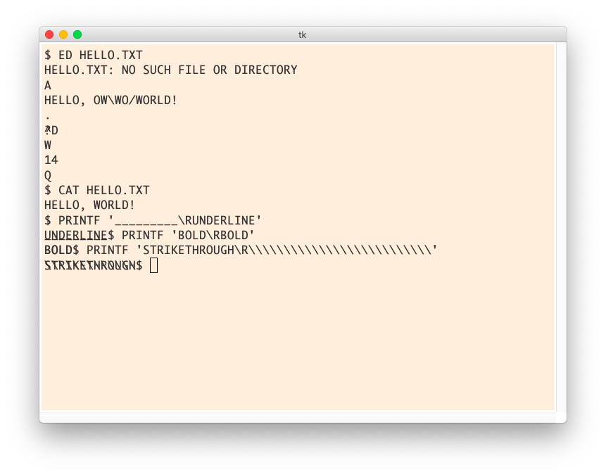

Terminal emulator for ASR-33.

Features:

- Pygame and Tkinter frontends.

- Backends for pty (Linux/Mac) and ssh (Paramiko library)

- Limits output to an authentic 10 characters per second. Hit F5 to make it go
  faster (toggle on tkinter frontend, hold on pygame)

- Scrolling (with page up and down - tkinter frontend has a scrollbar)

- Output a form feed to clear everything

Various bugs and to-dos:

- No user interface to select between frontends and backends. For now, edit the
  script.

- Speed throttling (whether through the backend or throttle.py) does not work
  well on Linux. It works on WSL, and the last time I checked this technique
  worked on macOS. You'll still get the 10-chars-per-second output, but
  interrupting long outputs won't work.

- Most of the fun termios functions (echoprt, echok, kill, reprint, discard)
  don't work on WSL

- Add tty-37 support (half lines, reverse line feed, and lowercase). For now,
  the forced uppercase can be disabled by editing the upper() function

- Add backends for wslbridge and msys/cygwin.

- Improve graphics, better font, allow "ink spread" for overstruck bold.

- Simulate classical 'stty lcase' line discipline for input of upper/lowercase
  letters and `` `{|}~`` (part or all of this are broken in modern OSes)

- Discard and regenerate scrollback to limit memory usage. The AbstractLine
  class I created should be useful for this, but nothing is hooked up.
